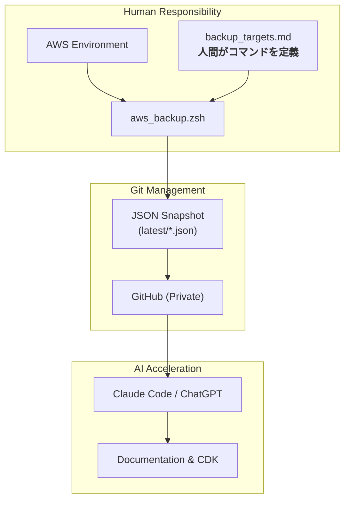
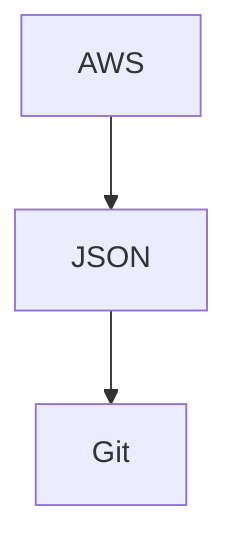
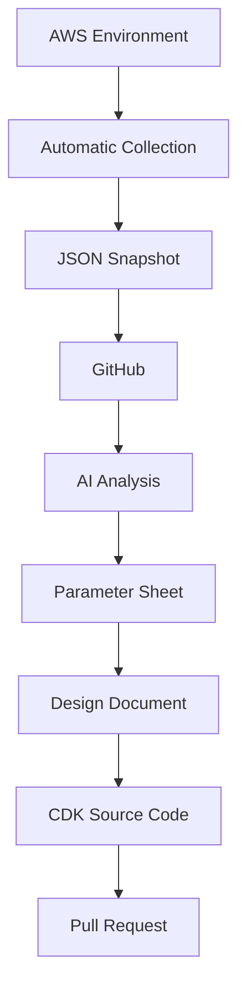

# AWS Config Backup

AIと人間の責任境界を明確にし、AWS環境の構造化・IaC・ドキュメント化を加速させるためのツールを提供します。

## Background

「AWSの構成を調べて」とAIに指示すれば、それらしいCLIコマンドを生成し、実行してくれる時代です。<br>
しかし、私たちはAIをそのように使いたいとは思いません。

何を正とするかの判断の帰結は、常に人間（設計者）の手元に残されるからです。<br>
何を収集するのかの定義は、アーキテクチャの意思の表れであり、信頼性の担保そのものです。

本ツールは、人間が定義した確かなコマンド群から得られたJSONスナップショットをGitで履歴管理し、<br>
AIの圧倒的な処理能力で解析・ドキュメント化・CDKコード化へと昇華させるためのパイプラインです。

## 🔒 Security Note / セキュリティについて
本リポジトリはAWS構成を自動収集するスクリプトを提供しています。

- 本スクリプトを実行して生成される構成データのJSONやログファイルには、機密性の高い情報が含まれる可能性があります。
- これらのデータをGitHub等で管理・共有する場合は、**必ず「Private（非公開）リポジトリ」を作成して運用してください。**
- AWSの認証情報（アクセスキー等）をコードやリポジトリ内に直接記述せず、必ず環境変数やローカルのプロファイル設定を利用してください。

---

## Architecture



### 1. Separation of Concerns

バックアップ対象と処理ロジックを分離します。

バックアップ対象は `backup_targets.md` に定義します。

形式:

```text
output-file-name|aws cli command
```

例:

```text
vpcs|aws ec2 describe-vpcs
security-groups|aws ec2 describe-security-groups
kms-keys|aws kms list-keys
```

- バックアップ対象を追加する場合でも、スクリプト本体を修正する必要なし
- 新しいAWSサービスをバックアップ対象へ追加する場合は、`backup_targets.md` にAWS CLIコマンドを1行追加するだけでOK

---

### 2. Git First

取得した構成情報は JSON のまま Git 管理する。



これにより、以下を実現します。

- 構成変更履歴の追跡
- git diff による差分確認
- Pull Request レビュー
- 構成監査
- 設計書と実環境の比較

が可能となります。


---

### 3. AI First

本プロジェクトは AI 活用を前提とします。

そのため本プロジェクトでは、`Human Readable` よりも `AI Readable` を重視しています。

例えば、収集した JSON を Claude や ChatGPT に読み込ませることで、

- AWS 構成分析
- リソース依存関係分析
- パラメータシート作成
- 基本設計書作成
- 詳細設計書作成
- システム構成図作成
- CDK 化方針策定

などを支援できます。

本プロジェクトの本質は、**AWS 環境を AI が理解可能な構造化データへ変換すること** にあリます。

---

## Use Cases

取得した JSON を Claude や ChatGPT に読み込ませることで、AWS 環境の分析および各種ドキュメント生成を支援できます。

### Parameter Sheet

AWS 環境のパラメータシートを自動生成します。

対象例:
- VPC / Subnet / Route Table / Security Group
- IAM / KMS / S3
- Lambda / API Gateway / Cognito / Aurora / RDS Proxy

従来は手作業で作成していた構成一覧や設定値一覧を効率的に作成できます。

---

### Design Documents

AWS 環境の設計書を生成ます。

生成対象例:
- 基本設計書 / 詳細設計書
- システム構成図
- 運用設計書 / 監視設計書 / セキュリティ設計書

JSON を根拠データとして利用することで、設計書と実環境の整合性を高めることができます。

---

### Infrastructure Analysis & IaC

AWS 環境の分析および IaC 化を支援ます。

分析例:
- AWS構成分析 / リソース依存関係分析 / セキュリティレビュー
- AWS CDK / Terraform / CloudFormation への移行検討・コード生成

特に既存環境の IaC 化を行う際の事前調査において、高い効果を発揮します。

---

## Directory Structure

```text
aws-config-backup/
├── README.md
├── .gitignore
├── script/aws_backup.zsh
└── aws-config-backup/
    ├── backup_targets.md
    ├── latest/
    │   ├── vpcs.json
    │   ├── subnets.json
    │   ├── security-groups.json
    │   └── ...
    └── logs/
        └── backup.log
```

---

## Security & Privacy (機密情報管理)

本リポジトリでは、実行ログや出力される構成情報（JSON）に含まれうるセンシティブデータ（アカウントID、IPアドレス、リソースARN等）の漏洩を防ぐため、`.gitignore` を活用した管理を推奨しています。

`.gitignore` 設定例:

```gitignore
# 実行ログの除外
aws-config-backup/logs/
*.log

# 一時ファイルの除外
*.tmp

# (オプション) ローカルでのみ保持し、Git管理から除外する場合
# aws-config-backup/latest/
```

※ チーム内でリポジトリをプライベート運用し、構成変更履歴をGitで追跡する場合は `latest/*.json` をコミット対象とします。
※　その場合は前述の通り、必ずリポジトリをPrivateで作成することを推奨します。

---

## Quick Start

### 前提条件

以下がインストール済みであり、AWS CLI の認証設定が完了していること。

- AWS CLI
- Git
- zsh
- （オプション）biome
- （オプション）claudeなど


確認:
```bash
aws sts get-caller-identity
```

---

### セットアップ & バックアップ実行

1. スクリプトに実行権限を付与します。
   ```bash
   chmod +x backup.sh
   ```

2. 設定ファイル `aws-config-backup/backup_targets.md` を用意します。

3. スクリプトを実行します。
   ```bash
   ./script/aws_backup.zsh
   ```

実行後、`aws-config-backup/latest/` 配下に JSON ファイルが出力され、`aws-config-backup/logs/backup.log` にログが保存されます。

---

### バックアップ対象の追加

`aws-config-backup/backup_targets.md` に形式に従って1行追加するだけで対象を拡張できます。

形式:
```text
file-name|aws cli command
```

例:
```text
vpcs|aws ec2 describe-vpcs
security-groups|aws ec2 describe-security-groups
```

---

## Vision

本プロジェクトが最終的に目指す姿。



AWS環境の構成情報を継続的に収集し、構成変更履歴を資産として蓄積できます。

そして同じ情報源を利用して、
- 構成管理
- 設計書管理
- IaC管理

を実現します。

従来は個別に管理されていた「AWS環境」「パラメータシート」「設計書」「IaCコード」を、単一の情報源から生成できる状態を目指します。

最終的には、AWS環境の変更が設計書やIaCへ継続的に反映される仕組みを構築し、「実環境」と「ドキュメント」と「コード」の乖離をなくすことを目標とします。

